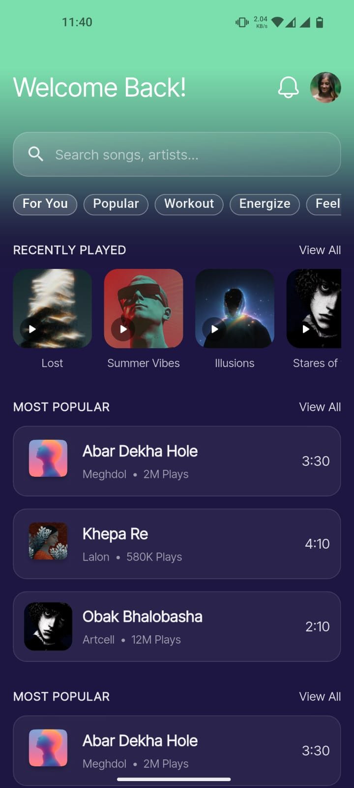
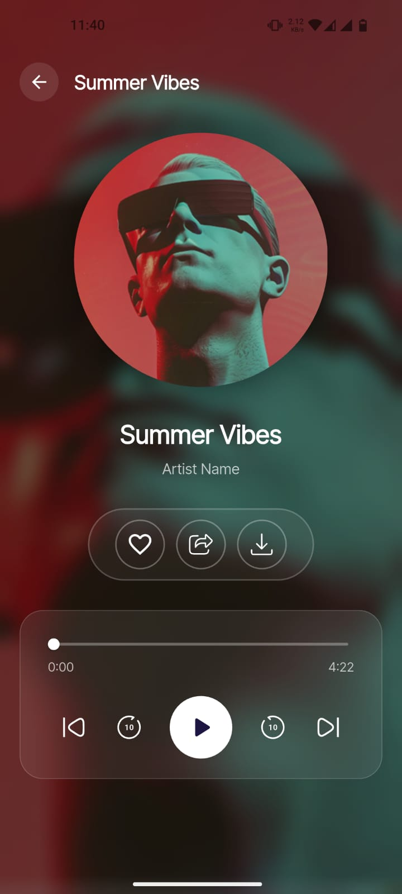
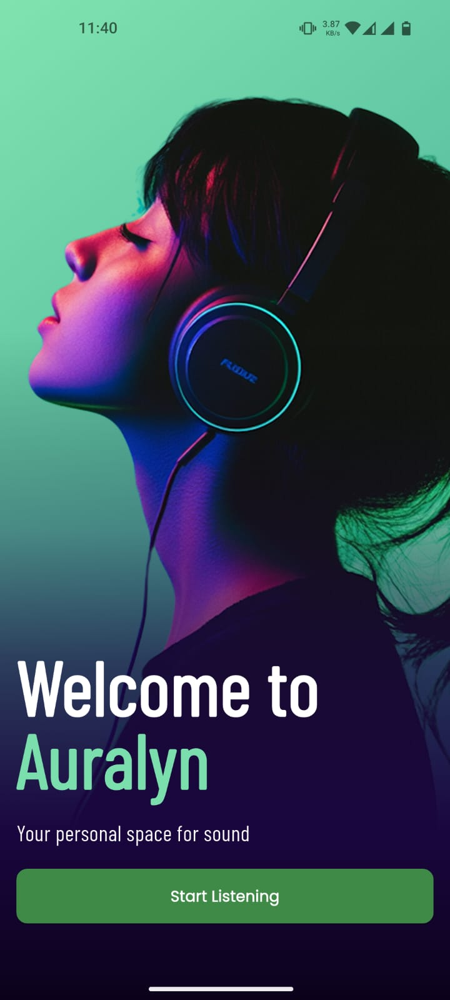

# Auralyn 🎧

**A minimal demo UI for a music app** — clean, modern, and intentionally simple.

---

## Demo Screenshots ✅

These are lightweight demo images located in `assets/demo/` (kept small and minimal).

<div style="display: flex; flex-wrap: wrap; justify-content: space-around; align-items: flex-start; gap: 15px;">
  
  
  
</div>

> Note: Images are constrained to **width: 320px** and **height: 680px** (using `object-fit: cover`) so they remain minimal and consistent across devices.

---

## About Auralyn 💡

Auralyn is a demo app design (not a full product). The UI is inspired by **@zesignli.uix** — it's a visual concept created to show a clean music player layout and micro-interactions.

---

## Quick Start 🔧

1. Install Flutter: https://flutter.dev/docs/get-started/install
2. Fetch packages:

   ```bash
   flutter pub get
   ```

3. Packages used 📦

- **flutter_svg** (^2.2.3) — for rendering SVG icons and illustrations
- **google_fonts** (^8.0.1) — for using Google Fonts in the UI

**Dev dependencies**:

- flutter_test
- flutter_lints

These are declared in `pubspec.yaml` — run `flutter pub get` to fetch them. Assets used for the README are in `assets/demo/` — ensure `pubspec.yaml` includes them if you run the project.

---

## Credits & Follow ♡

- Design inspiration: https://www.instagram.com/zesignli.uix/
- Follow us for more videos:
  - Instagram: https://www.instagram.com/blackosra/
  - YouTube: https://www.youtube.com/BlackOsRa

---

If you'd like a different image size or layout in the README, tell me the preferred max width/height and I will update it. 🎨
